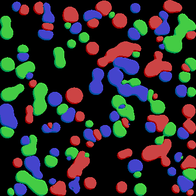

# ebiten-metaballs

`ebiten-metaballs` is a Go package for rendering 2D metaballs with Ebiten v2. Metaballs are defined as circles, with optional bridges between circle pairs. Groups provide independent colors; each group is rendered as a main field while the other groups drive the squeezing/intersection field.



## Requirements

- Go 1.27 or newer
- `github.com/hajimehoshi/ebiten/v2` v2.9.10
- An Ebiten-compatible graphics environment at runtime

The module path is `github.com/razzie/ebiten-metaballs`.

## Data model

```go
type Circle struct {
	X, Y   float32
	Radius float32
}

type Bridge struct {
	A, B         int
	MiddleRadius float32
}

type Group struct {
	Circles []Circle
	Bridges []Bridge
	Color   ebiten.ColorScale
}
```

Circle positions and radii are expressed in UV units. `Bridge.A` and `Bridge.B` are indices into the same group's `Circles` slice. Both indices must be valid. A bridge uses the endpoint circles' radii and its own `MiddleRadius` to form a continuous field between the endpoints.

`NewColorScale(r, g, b, a)` constructs an `ebiten.ColorScale` for a group.

## Direct shader rendering

`MetaballShader` renders all groups directly in one or more shader passes. Create its fixed shader array capacities from the input groups:

```go
groups := []metaballs.Group{
	{
		Circles: []metaballs.Circle{
			{X: 0.50, Y: 0.50, Radius: 0.10},
		},
		Color: metaballs.NewColorScale(1, 0, 0, 1),
	},
}

shader, err := metaballs.NewMetaballShader(metaballs.ShaderConfig{
	ShaderCapacity: metaballs.CapacityForGroups(groups),
	ShaderCommonConfig: metaballs.ShaderCommonConfig{
		SmoothK:       0.1,
		LightDirX:     1,
		LightDirY:     -1,
		EdgeThickness: 0.04,
	},
})
if err != nil {
	return err
}

if err := shader.Draw(dst, groups); err != nil {
	return err
}
```

`ShaderCapacity` contains compile-time array sizes:

- `MainCircles` and `MainBridges` must fit the largest individual group.
- `OtherCircles` and `OtherBridges` must fit the combined contents of all other groups.
- `MainCircles` must be positive. The other capacity fields may be zero.

`CapacityForGroups` computes these bounds. Shader construction compiles an embedded Kage template; it fails if `SmoothK <= 0`, capacities are invalid, bridge indices are invalid during drawing, or edge-shading configuration is invalid.

`ShaderCommonConfig` is shared by all generated shader tiers:

- `SmoothK` controls smooth-min blending and must be positive.
- `LightDirX` and `LightDirY` select the edge-light direction. `(0, 0)` disables edge shading.
- `EdgeThickness` must be positive when edge shading is enabled.

### UV scaling

`Draw` maps the destination to UV scale `{1 / width, 1 / height}`. This makes the UV domain `[0, 1] x [0, 1]`, but circles are not aspect-correct on non-square destinations.

Use `DrawScaled` with a uniform pixel scale to preserve circular shapes:

```go
// For a destination with height h:
err := shader.DrawScaled(dst, groups, [2]float32{1 / float32(h), 1 / float32(h)})
```

`DrawScaledAt` additionally accepts an origin in destination pixels. It is intended for drawing into a sub-image while retaining coordinates from the full destination.

## Tiled renderer

`Renderer` filters groups against tiles, skips empty tiles, subdivides tiles that exceed a shader tier, and selects the smallest tier whose capacities fit the tile. If a tile still exceeds the largest tier at `MaxDepth`, the renderer draws it with that tier and clips excess circles.

```go
renderer, err := metaballs.NewRenderer(metaballs.RendererConfig{
	Common: metaballs.ShaderCommonConfig{SmoothK: 0.03},
	Tiers: []metaballs.ShaderCapacity{
		{MainCircles: 16, OtherCircles: 16},
		{MainCircles: 32, OtherCircles: 32},
	},
	RootCols:    1,
	RootRows:    1,
	MaxDepth:    3,
	MinTileSize: 0.01,
	Workers:     1,
})
if err != nil {
	return err
}

stats, err := renderer.Draw(dst, groups)
```

`RendererConfig` fields:

- `Common`: shader constants shared by all tiers.
- `Tiers`: ascending shader capacities. Each tier is compiled at construction time.
- `RootCols`, `RootRows`: initial tile grid dimensions.
- `MaxDepth`: maximum number of four-way subdivisions below the root grid.
- `MinTileSize`: minimum UV width and height for subdivision.
- `Debug`: draws tile outlines for skipped, subdivided, and rendered tiles.
- `Workers`: number of CPU workers for filtering and tile planning. Values `0` and `1` are serial. Ebiten draw calls remain serialized.
- `PoolMaxCircles`, `PoolMaxBridges`, `PoolMaxGroups`: optional initial scratch-pool sizes. Pools grow as needed and never shrink.

`DrawScaled(dst, groups, uvScale)` is the renderer equivalent of `MetaballShader.DrawScaled`. The visible UV domain is the destination pixel dimensions multiplied by `uvScale`. Both scale components must be positive.

`Renderer.Draw` and `Renderer.DrawScaled` are not safe for concurrent use on the same renderer. Use a separate renderer per goroutine.

`Stats` reports the last draw:

- `TilesDrawn`: tiles that issued shader draws.
- `TilesSkipped`: empty tiles skipped by filtering.
- `CirclesClipped`: circles removed by largest-tier fallback at the subdivision limit.

## Examples

Run an example from the repository root:

```text
go run ./examples/helloworld
go run ./examples/manycircles
go run ./examples/manycirclesgif
go run ./examples/bridges
```

- `helloworld` uses `MetaballShader` directly.
- `manycircles` demonstrates renderer tiling with many moving circles.
- `manycirclesgif` demonstrates moving clustered circles and bridges; its captured output is shown above.
- `bridges` demonstrates explicit circle connections.