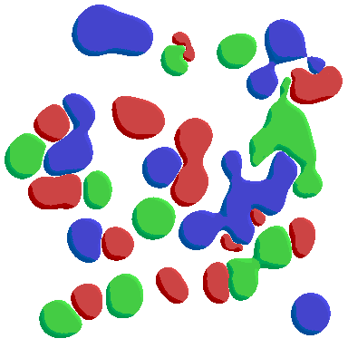

# ebiten-metaballs

`ebiten-metaballs` is a Go package for rendering 2D metaballs with Ebiten v2. Metaballs are defined as circles, with optional bridges between circle pairs. Groups provide independent colors. All circles and bridges are evaluated in one shader pass, with separate fields for each group and smooth contacts between colors.



## Requirements

- Go 1.27 or newer
- `github.com/hajimehoshi/ebiten/v2` v2.9.10
- An Ebiten-compatible graphics environment at runtime

The module path is `github.com/razzie/ebiten-metaballs`.

## Data model

```go
type Circle struct {
	X, Y   float32
	Radius float32
}

type Bridge struct {
	A, B         int
	MiddleRadius float32
}

type Group struct {
	Circles []Circle
	Bridges []Bridge
	Color   ebiten.ColorScale
}
```

Circle positions and radii are expressed in UV units. `Bridge.A` and `Bridge.B` are indices into the same group's `Circles` slice. Both indices must be valid. A bridge uses the endpoint circles' radii and its own `MiddleRadius` to form a continuous field between the endpoints.

Circles and bridges within each group merge through a smooth minimum. After evaluating every primitive once, the shader finds the two lowest group distances in one scan. It squeezes the closest group using `mainDistance - smin(otherDistance, 0, SmoothK/2)`. Competing colors stay separate: the opposing distance is a minimum of group fields, never a smooth union of all opposing circles.

Contacts follow the blended group shapes directly. There is no additional pressure field or nearest-circle lookup. Lighting uses the analytic gradient of the squeezed distance. The blended radius only limits edge thickness; it no longer biases contact placement. Isolated overlapping circles therefore yield by equal depths, and a small circle buried in a deeper competing field can disappear. A large `SmoothK` can also erase small regions through contact rounding.

Primitives are blended in their supplied order without a per-pixel distance cutoff. A primitive farther than `SmoothK` can still affect the contour through intermediate blends; cutting it off introduces notches and lighting jumps. The tiled renderer conservatively pads each group's primitives by `(primitiveCount + 0.5) * SmoothK`, including the contact-rounding margin. Large groups or large `SmoothK` values therefore reduce culling efficiency and may require larger shader tiers. Two equal circles can still have a straight contact, and junctions between three colors can have corners. Exactly tied group fields share an empty boundary; completely coincident identical groups cannot remain individually visible.

`NewColorScale(r, g, b, a)` constructs an `ebiten.ColorScale` for a group.

## Direct shader rendering

`MetaballShader` renders all groups in one metaball pass, followed by an optional FXAA pass. Create its fixed shader array capacities from the input groups:

```go
groups := []metaballs.Group{
	{
		Circles: []metaballs.Circle{
			{X: 0.50, Y: 0.50, Radius: 0.10},
		},
		Color: metaballs.NewColorScale(1, 0, 0, 1),
	},
}

shader, err := metaballs.NewMetaballShader(metaballs.ShaderConfig{
	ShaderCapacity: metaballs.CapacityForGroups(groups),
	ShaderCommonConfig: metaballs.ShaderCommonConfig{
		SmoothK:       0.1,
		LightDirX:     1,
		LightDirY:     -1,
		EdgeThickness: 0.04,
	},
})
if err != nil {
	return err
}

xform, _ := metaballs.NewCenteredUVTransform(dst.Bounds().Dx(), dst.Bounds().Dy())
if err := shader.Draw(dst, groups, xform); err != nil {
	return err
}
```

`ShaderCapacity` contains compile-time array sizes:

- `Groups` must fit the number of nonempty groups.
- `Circles` and `Bridges` must fit the **totals across all groups**.
- `Groups` and `Circles` must be positive; `Bridges` may be zero.

These replace the previous `MainCircles`, `OtherCircles`, `MainBridges`, and `OtherBridges` fields. `CapacityForGroups` supplies the new counts automatically. Explicit renderer tiers must use the new total capacities.

`CapacityForGroups` computes these bounds. Shader construction compiles an embedded Kage template; it fails if `SmoothK <= 0`, capacities are invalid, bridge indices are invalid during drawing, or edge-shading configuration is invalid.

`ShaderCommonConfig` is shared by all generated shader tiers:

- `SmoothK` controls shape blending and contact rounding. It must be positive.
- `LightDirX` and `LightDirY` select the edge-light direction. `(0, 0)` disables edge shading.
- `EdgeThickness` must be positive when edge shading is enabled.
- `FxaaEnabled` enables FXAA post-processing. `FxaaReduceMin`, `FxaaReduceMul`, and `FxaaSpanMax` tune the FXAA edge-detection thresholds (defaults: 128, 8, 8).

`MetaballShader.Draw` and `MetaballShader.DrawAt` are not safe for concurrent use on the same shader instance when FXAA is enabled, unless it is enabled at the `Renderer` level.

### UV scaling

`Draw(dst, groups, xform)` maps destination pixel coordinates through a `UVTransform`. Both scale components must be positive.

Use `NewCenteredUVTransform` to preserve circular shapes and center the scene:

```go
xform, _ := metaballs.NewCenteredUVTransform(width, height)
err := shader.Draw(dst, groups, xform)
```

`DrawAt(dst, groups, xform, offset)` translates the scene in destination pixels: positive X moves right and positive Y moves down. Sub-images clip the scene while retaining the parent's coordinates; no additional offset is needed to compensate for their bounds. Sampling uses `uv = (destinationPixel - offset) * scale + uvOffset`.

## Tiled renderer

`Renderer` filters groups against tiles, skips empty tiles, subdivides tiles that exceed a shader tier, and selects the smallest tier whose capacities fit the tile. If a tile still exceeds the largest tier at `MaxDepth`, the renderer draws it with that tier and clips excess circles/groups and bridges whose endpoints were removed. Each drawn tile uses one metaball pass.

```go
renderer, err := metaballs.NewRenderer(metaballs.RendererConfig{
	Common: metaballs.ShaderCommonConfig{SmoothK: 0.03},
	Tiers: []metaballs.ShaderCapacity{
		{Groups: 3, Circles: 32},
		{Groups: 3, Circles: 64},
	},
	RootCols:    1,
	RootRows:    1,
	MaxDepth:    3,
	MinTileSize: 0.01,
	Workers:     1,
})
if err != nil {
	return err
}

stats, err := renderer.Draw(dst, groups, xform)
```

`RendererConfig` fields:

- `Common`: shader constants shared by all tiers.
- `Tiers`: ascending shader capacities. Each tier is compiled at construction time.
- `RootCols`, `RootRows`: initial tile grid dimensions.
- `MaxDepth`: maximum number of four-way subdivisions below the root grid.
- `MinTileSize`: minimum UV width and height for subdivision.
- `Debug`: draws tile outlines for skipped, subdivided, and rendered tiles.
- `Workers`: number of CPU workers for filtering, tile planning and draw calls. Values `0` and `1` are serial.
- `PoolMaxCircles`, `PoolMaxBridges`, `PoolMaxGroups`: optional initial scratch-pool sizes. Pools grow as needed and never shrink.

`Draw(dst, groups, xform)` and `DrawAt(dst, groups, xform, offset)` follow the same coordinate rules as `MetaballShader`.
The visible UV domain comes from the destination bounds minus the scene's pixel offset, mapped through `xform`. Both scale components must be positive.
The draw methods are not safe for concurrent use on the same renderer. Use a separate renderer per goroutine.

`Renderer` also exposes runtime configuration helpers for the tiling grid and debug overlay:

- `SetRootTiles(cols, rows)` reconfigures the initial coarse root grid used before adaptive subdivision.
- `SetDebug(enabled)` toggles debug outlines for skipped, subdivided, and rendered tiles.

These setters are not safe to call while rendering is in progress.

`Stats` reports the last draw:

- `TilesDrawn`: tiles that issued shader draws.
- `TilesSkipped`: empty tiles skipped by filtering.
- `CirclesClipped`: circles removed by largest-tier fallback at the subdivision limit.

## Examples

Run an example from the repository root:

```text
go run ./examples/helloworld
go run ./examples/manycircles
go run ./examples/demogif
go run ./examples/bridges
go run ./examples/physics
```

- `helloworld` uses `MetaballShader` directly.
- `manycircles` demonstrates renderer tiling with many moving circles.
- `demogif` renders moving clustered circles to gif; its captured output is shown above.
- `bridges` demonstrates moving clustered circles and bridges.
- `physics` uses the [softbody package](softbody) for shared circle collisions, damped outer shells, and a hexagonal spatial grid. Hold the left mouse button to attract all red metaballs, middle for greens, and right for blues. Attraction continuously follows the cursor while the button is held. Hold Space to push nearby circles away from the mouse pointer, regardless of group.
