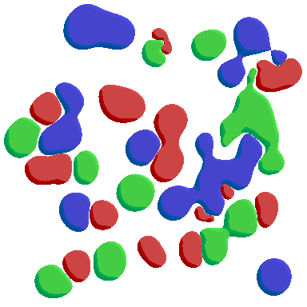

# ebiten-metaballs

`ebiten-metaballs` renders 2D metaballs in Go with Ebitengine (Ebiten v2). Nearby shapes in the same color group merge smoothly; shapes in different groups deform against one another. Build scenes from circles, bridges, and rigid wall segments, with optional edge lighting, borders, and antialiasing.

The package handles rendering. For interactive circle physics and connected soft bodies, use the optional [`softbody` package](softbody/README.md).



## Requirements

- Go 1.27 or newer
- `github.com/hajimehoshi/ebiten/v2` v2.9.10
- An Ebiten-compatible graphics environment at runtime

The module path is `github.com/razzie/ebiten-metaballs`.

## Quick start

To try the interactive demo:

```sh
git clone https://github.com/razzie/ebiten-metaballs.git
cd ebiten-metaballs
go run ./examples/helloworld
```

Move the mouse to control the blue metaballs. Other examples, run from the repository root:

| Example | What it shows |
| --- | --- |
| [walls](examples/walls) | Rigid segments, same-group blending, and contacts between groups |
| [bridges](examples/bridges) | Connected soft bodies, dragging, and borders |
| [manycircles](examples/manycircles) | Adaptive tiling for a larger scene |
| [physics](examples/physics) | Circle physics and group-filtered attraction/repulsion |
| [polygons](examples/polygons) | Solid physics obstacles with matching rendered wall boundaries |
| [water](examples/water) | A geometry buffer consumed by a custom water shader |

For example, `go run ./examples/walls` launches the wall demo.

### Use it in your game

In your Go module, add the package:

```sh
go get github.com/razzie/ebiten-metaballs
```

Here is a complete `main.go` that draws two merging circles. Create the shader once, then update the circles in `Update` and render them in `Draw`:

```go
package main

import (
	"log"

	"github.com/hajimehoshi/ebiten/v2"
	metaballs "github.com/razzie/ebiten-metaballs"
)

type Game struct {
	shader *metaballs.MetaballShader
	groups []metaballs.Group
}

func (g *Game) Update() error { return nil }

func (g *Game) Draw(screen *ebiten.Image) {
	xform, _ := metaballs.NewCenteredUVTransform(screen.Bounds().Dx(), screen.Bounds().Dy())
	if err := g.shader.Draw(screen, g.groups, xform); err != nil {
		panic(err)
	}
}

func (g *Game) Layout(_, _ int) (int, int) { return 800, 600 }

func main() {
	groups := []metaballs.Group{{
		Circles: []metaballs.Circle{
			{X: 0.42, Y: 0.5, Radius: 0.12},
			{X: 0.58, Y: 0.5, Radius: 0.12},
		},
		Color: metaballs.NewColorScale(0.2, 0.8, 0.6, 1),
	}}
	shader, err := metaballs.NewMetaballShader(metaballs.ShaderConfig{
		ShaderCapacity:     metaballs.CapacityForGroups(groups),
		ShaderCommonConfig: metaballs.ShaderCommonConfig{SmoothK: 0.03},
	})
	if err != nil {
		log.Fatal(err)
	}
	ebiten.SetWindowSize(800, 600)
	ebiten.SetWindowTitle("Metaballs")
	if err := ebiten.RunGame(&Game{shader: shader, groups: groups}); err != nil {
		log.Fatal(err)
	}
}
```

Run it with `go run .`. Add more groups to give shapes different colors; add bridges or walls using the model below.

## Data model

```go
type Circle struct {
	X, Y   float32
	Radius float32
}

type Bridge struct {
	A, B         int
	MiddleRadius float32
}

type Wall struct {
	AX, AY, BX, BY float32
	Thickness      float32
}

type Group struct {
	Circles []Circle
	Bridges []Bridge
	Walls   []Wall
	Color   ebiten.ColorScale
}
```

A `Group` gives its primitives one color, created with `NewColorScale(r, g, b, a)`. Its circles blend first, then its bridges, then its walls, each in slice order. Keep that order stable between frames: changing it can change the shape and lighting.

### Circles and bridges

Circle positions and radii use UV units, explained under [Coordinates](#coordinates). `Bridge.A` and `Bridge.B` are valid indices into the **same group's** `Circles` slice. A bridge connects their centers with a varying radius: half each circle's radius at the endpoints, interpolated smoothly through `MiddleRadius` at the midpoint. Bridges blend into the circles to form a continuous shape.

```go
group := metaballs.Group{
	Circles: []metaballs.Circle{
		{X: 0.25, Y: 0.5, Radius: 0.08},
		{X: 0.75, Y: 0.5, Radius: 0.08},
	},
	Bridges: []metaballs.Bridge{{A: 0, B: 1, MiddleRadius: 0.02}},
	Color: metaballs.NewColorScale(0.2, 0.8, 0.6, 1),
}
```

### Walls

Walls use their own endpoints rather than circle indices:

```go
group.Walls = []metaballs.Wall{
	{AX: 0.2, AY: 0.3, BX: 0.8, BY: 0.3, Thickness: 0.04},
	{AX: 0.2, AY: 0.3, BX: 0.2, BY: 0.8}, // zero-width line
}
```

`Thickness` is the full width in UV units, with round ends. Coordinates and thickness must be finite, and thickness must be nonnegative. Coincident endpoints form a disk of radius `Thickness/2`. A group can contain only walls.

An isolated zero-width wall has no filled area, but it still participates in blending and contact; blending nearby primitives can create filled regions. Borders do not thicken the original wall geometry.

Walls blend with their own group's circles and bridges. Their original geometry is protected during squeezing, so other groups take the full displacement at a wall instead of sharing it. Walls are two-sided: a circle crossing a segment can appear on both sides. Intersecting walls retain their geometry; the deeper wall owns an overlap, with equal depths favoring the earlier group.

Put walls in a separate group when other shapes should yield against them. Try `go run ./examples/walls` to see both behaviors. Walls are rendering primitives and do not add collisions to the `softbody` simulation. For solid polygon obstacles with physics, see [the polygons example](examples/polygons).

## Coordinates

`Draw(dst, groups, xform)` maps destination pixel coordinates through a `UVTransform`. Positions, radii, wall thickness, `SmoothK`, and edge/border thickness all use the same UV units. Both scale components must be positive.

Use `NewCenteredUVTransform` to preserve circular shapes and center the scene at `(0.5, 0.5)`. The shorter screen dimension spans one UV unit; the longer dimension shows more of the scene. For example, on an 800 × 600 image, a radius of `0.1` is 60 pixels. Recompute the transform when the destination size changes:

```go
xform, _ := metaballs.NewCenteredUVTransform(width, height)
err := shader.Draw(dst, groups, xform)
```

`DrawAt(dst, groups, xform, offset)` translates the scene in destination pixels: positive X moves right and positive Y moves down. Sub-images clip the scene while retaining the parent's coordinates; no additional offset is needed to compensate for their bounds. Sampling uses `uv = (destinationPixel - offset) * scale + uvOffset`.

For pixel coordinates, initialize a transform with `xform.SetScale(1, 1)` and leave its offset at zero. A radius of `20` then means 20 pixels. `xform.ScreenToUV(mx, my)` converts pointer coordinates to scene coordinates; when using `DrawAt`, subtract its pixel offset from the pointer position first.

## Direct shader rendering

`MetaballShader` draws the entire supplied scene in one metaball pass, followed by an optional FXAA antialiasing pass. The quick-start program uses this API:

```go
err := shader.Draw(dst, groups, xform)
```

`ShaderCapacity` contains compile-time array sizes:

- `Groups` must fit the number of nonempty groups.
- `Circles`, `Bridges`, and `Walls` must fit the **totals across all groups**.
- `Groups` must be positive, and at least one of `Circles` or `Walls` must be positive. Primitive capacities are nonnegative.

`CapacityForGroups` computes these counts for the supplied scene. Capacities are fixed when the shader is created: moving or resizing primitives is fine, but adding more than it can hold requires a new shader or larger capacities chosen up front. An empty scene produces zero capacities and cannot be used to construct a shader.

`NewMetaballShader` compiles an embedded Kage template and rejects invalid capacities or configuration. `Draw` and `DrawAt` return errors for capacity overflow, invalid bridge indices, invalid walls, or nonpositive UV scales. Create shaders once during setup and reuse them each frame.

When FXAA is enabled on a direct shader, its draw calls must not run concurrently on the same instance because they share an offscreen buffer. The tiled renderer manages FXAA once for the whole scene, allowing its internal tile workers to share shaders.

When migrating older code, replace `MainCircles`, `OtherCircles`, `MainBridges`, and `OtherBridges` with totals in `Circles` and `Bridges`, plus `Groups` and `Walls` as needed.

## Appearance

`ShaderCommonConfig` sets the style for a direct shader or every tier of a tiled renderer. These settings are fixed at construction:

- `SmoothK` controls shape blending and contact rounding. It must be positive.
- `LightDirX` and `LightDirY` select the edge-light direction. `(0, 0)` disables edge shading.
- `EdgeThickness` must be positive when edge shading is enabled in color rendering.
- `BorderThickness` adds an inset border in UV units, using 35% of the group color's RGB and preserving its alpha. It must be finite and nonnegative; zero preserves the original style. Borders work with or without lighting, and lighting follows the inset fill's edge. Circle radii include the border; bridge endpoint radii are clamped to at least the border thickness, while `MiddleRadius` is preserved. Wall thickness is unchanged.
- `FxaaEnabled` enables FXAA post-processing. `FxaaReduceMin`, `FxaaReduceMul`, and `FxaaSpanMax` tune the FXAA filter (defaults: 128, 8, 8 when left at zero). The two reduction values are used as divisors; `FxaaSpanMax` limits the sampling span.

### Borders and shared joints

With borders enabled, a circle with `Radius: 0` is a solid joint, equivalent to `Radius: BorderThickness`. Connect any number of bridges to that circle's index to create a shared junction. Features whose blended radius is at most the border thickness stay solid, without a colored center. For example, three bridges can share circle 3:

```go
group := metaballs.Group{
	Circles: []metaballs.Circle{
		{X: 0.2, Y: 0.7, Radius: 0.12},
		{X: 0.7, Y: 0.2, Radius: 0.06},
		{X: 0.8, Y: 0.8, Radius: 0.04},
		{X: 0.5, Y: 0.5, Radius: 0}, // shared joint
	},
	Bridges: []metaballs.Bridge{
		{A: 0, B: 3, MiddleRadius: 0.008},
		{A: 1, B: 3, MiddleRadius: 0.008},
		{A: 2, B: 3, MiddleRadius: 0.008},
	},
	Color: metaballs.NewColorScale(0.7, 0.85, 0.8, 1),
}
// Use SmoothK: 0.03 and BorderThickness: 0.012 in ShaderCommonConfig.
```

## Tiled renderer

Use `MetaballShader` for a small scene and `Renderer` when you want to skip empty areas or use smaller shaders for sparse regions. `Renderer` filters groups against tiles, skips empty tiles, subdivides crowded tiles, and selects the smallest shader tier whose capacities fit each tile.

If a tile still exceeds the largest tier when `MaxDepth` or `MinTileSize` prevents further subdivision, the renderer clips excess circles, walls, groups, and bridges, including bridges whose endpoints were removed. Each drawn tile uses one metaball pass. When `Common.FxaaEnabled` is true, FXAA runs once after all tiles are drawn.

```go
renderer, err := metaballs.NewRenderer(metaballs.RendererConfig{
	Common: metaballs.ShaderCommonConfig{SmoothK: 0.03},
	Tiers: []metaballs.ShaderCapacity{
		{Groups: 3, Circles: 32, Bridges: 16, Walls: 8},
		{Groups: 3, Circles: 64, Bridges: 32, Walls: 16},
	},
	RootCols:    1,
	RootRows:    1,
	MaxDepth:    3,
	MinTileSize: 0.01,
	Workers:     1,
})
if err != nil {
	return err
}

stats, err := renderer.Draw(dst, groups, xform)
if err != nil {
	return err
}
clipped := stats.CirclesClipped.Load() // Stats counters are atomic.Int32.
_ = clipped
```

Tier counts are **totals per tile**, including bridge endpoint circles kept during filtering. Give each tier enough `Bridges` and `Walls` capacity for your scene; zero leaves no room for that primitive. Each capacity must stay the same or increase from one tier to the next.

`RendererConfig` fields:

- `Common`: shader constants shared by all tiers.
- `Tiers`: ascending shader capacities. Each tier is compiled at construction time.
- `RootCols`, `RootRows`: initial tile grid dimensions.
- `MaxDepth`: maximum number of four-way subdivisions below the root grid.
- `MinTileSize`: minimum UV width and height for child tiles. It must be positive; `RootCols` and `RootRows` must also be positive.
- `Debug`: draws outlines for nonempty tiles visited during subdivision or rendering. Empty skipped tiles have no outline. Incompatible with geometry-buffer output.
- `Workers`: number of CPU workers for filtering, tile planning and draw calls. Values `0` and `1` are serial.
- `PoolMaxCircles`, `PoolMaxBridges`, `PoolMaxWalls`, `PoolMaxGroups`: optional initial scratch-pool sizes. Pools grow as needed and never shrink.

`Draw(dst, groups, xform)` and `DrawAt(dst, groups, xform, offset)` follow the same coordinate rules as `MetaballShader`.
The visible UV domain comes from the destination bounds minus the scene's pixel offset, mapped through `xform`. Both scale components must be positive.
The draw methods are not safe for concurrent use on the same renderer. Use a separate renderer per goroutine.

`Renderer` also exposes runtime configuration helpers for the tiling grid and debug overlay:

- `SetRootTiles(cols, rows)` requires positive dimensions and reconfigures the initial coarse root grid used before adaptive subdivision.
- `SetDebug(enabled)` toggles tile outlines; keep it disabled in geometry-buffer mode.

These setters are not safe to call while rendering is in progress.

`Draw` returns `*Stats` with atomic counters; read each with `.Load()`:

- `TilesDrawn`: tiles that issued shader draws.
- `TilesSkipped`: empty tiles skipped by filtering.
- `CirclesClipped`: circles removed by largest-tier fallback at a subdivision limit. A circle filtered into multiple tiles can be counted multiple times; dropped walls and bridges are not reported.

The renderer filters with a margin of `SmoothK + BorderThickness` around circles and bridges; wall bounds also include half their thickness and, when lighting is enabled, `EdgeThickness`. Larger margins retain more primitives per tile. Filtering can change smooth blends in dense scenes, so tiled output is not guaranteed to match a full-scene draw exactly. Use a direct shader when matching the complete field is essential, and increase tiers or allow more subdivision when fallback clipping removes visible geometry.

## Softbody package

The optional `softbody` package provides 2D circle physics for interactive metaballs and connected soft bodies. Each circle has a hard inner core, a compressible outer shell, mass, and velocity. Shells compress on contact while cores keep circles from collapsing into one another. Bridges connect circles with springs or distance limits, and static polygons act as solid obstacles.

Create a world with `softbody.New`, add circles with `AddCircle`, advance the simulation with `Step`, and read their positions with `Snapshot` for rendering. The package is independent of the renderer; your application chooses colors and input controls. Drag-and-drop and radial impulses support grabbing, attracting, and repelling circles.

Render each snapshot circle with its `OuterRadius`. Snapshot order can change between steps, so sort by stable circle ID to keep rendering order consistent. Physics bridges use stable circle IDs; rendering bridges use slice indices. Map IDs to the current group's circle indices when converting `BridgeSnapshot` results, as the bridges example does.

See the [softbody documentation](softbody/README.md) for setup, API details, and configuration. The [physics](examples/physics), [bridges](examples/bridges), and [polygons](examples/polygons) examples show it in use. Run an example from the repository root with `go run ./examples/physics`, or browse [all examples](examples).

## Advanced rendering

### Blending and contact behavior

Circles, bridges, and walls within each group merge through a smooth minimum. For ordinary contacts between groups, after evaluating every primitive once, the shader finds the two lowest group distances in one scan. It squeezes the closest group using `mainDistance - smin(otherDistance, 0, SmoothK/2)`. Competing colors stay separate: the opposing distance is a minimum of group fields, never a smooth union of all opposing circles.

Contacts follow the blended group shapes directly. Lighting uses the analytic gradient of the squeezed distance. The blended radius controls edge thickness and border fill; it does not bias contact placement. Isolated overlapping circles therefore yield by equal depths, and a small circle buried in a deeper competing field can disappear. A large `SmoothK` can also erase small regions through contact rounding.

Primitives are blended in their supplied order without a per-pixel distance cutoff. Smooth-min blending is not associative: reordering three or more primitives can change the shape and lighting even when their positions are unchanged. Keep circle, bridge, and wall order stable between frames. The physics, bridges, and polygons examples sort snapshots by stable circle ID before rendering because the simulation reorders its storage by grid cell.

A primitive whose individual distance exceeds `SmoothK` can still affect the contour through intermediate blends. The direct shader evaluates every supplied primitive without a distance cutoff; tiled filtering may omit such contributions. Two equal circles can still have a straight contact, and junctions between three colors can have corners. Switching the nearest competing group preserves distance continuity but can abruptly change the lighting gradient at those junctions. Without protected wall geometry, exactly tied group fields share an empty boundary; completely coincident identical groups cannot remain individually visible. Rigid wall overlaps instead favor the deeper wall, with ties going to the earlier group.

### Geometry buffer

Set `ShaderCommonConfig.GeometryBuffer: true` on a shader or tiled renderer to output the final field after group squeezing and rigid-wall contacts: **xy = gradient, z = distance, w = blended radius**. Group colors, edge lighting, and inset border coloring are skipped. Border-related joint and bridge geometry still applies. The gradient retains its magnitude through blends and contacts; normalize it only when you need a surface normal.

Ebitengine images use 8-bit channels in `[0, 1]`, so signed gradients and UV-space lengths are encoded rather than written raw. With `k = SmoothK`, the stored channels are:

| Channels | Encoding |
| --- | --- |
| xy | `0.5 + 0.5 * gradient / (1 + abs(gradient))` |
| z | `-distance / (k - distance)` |
| w | `radius / (k + radius)` |

Only pixels inside the final silhouette are written (distance < 0). Clear the geometry image each frame; a cleared pixel with `w == 0` has no geometry. Geometry draws use `ebiten.BlendCopy`, preserving the radius channel independently of opacity. Sample the image directly in a Kage shader, without alpha unpremultiplication or texture filtering, and decode it using the same `SmoothK`:

```go
data := imageSrc0At(srcPos)
if data.w == 0.0 {
    // No geometry here.
    return vec4(0.0)
}
e := data.xy*2.0 - 1.0
gradient := e / max(vec2(1.0)-abs(e), vec2(1.0/255.0))
distance := -SmoothK*data.z / max(1.0-data.z, 1.0/255.0)
radius := SmoothK*data.w / max(1.0-data.w, 1.0/255.0)
```

Lengths are in the scene's UV units, including when UV units are pixels. RGBA8 quantization limits precision, especially for lengths much larger than `SmoothK` or very small radii. Constructors reject geometry mode combined with FXAA; renderer debug overlays are also rejected because they overwrite data. Apply any color antialiasing in the consuming shader or after that pass.

The [water example](examples/water) renders this buffer and uses a custom shader for refracted pool tiles, animated caustics and ripples, Fresnel reflections, specular highlights, and shoreline foam:

```sh
go run ./examples/water
```

Drag droplets to reshape the water, press Space to pause, G to inspect the gradient/distance/radius channels, and R to reset.

### Optional SIMD

With Go 1.27, `GOEXPERIMENT=simd` enables SIMD paths for the renderer's circle/tile overlap filtering and the softbody simulation. Without it, scalar implementations are selected automatically:

```sh
GOEXPERIMENT=simd go run ./examples/manycircles
```
